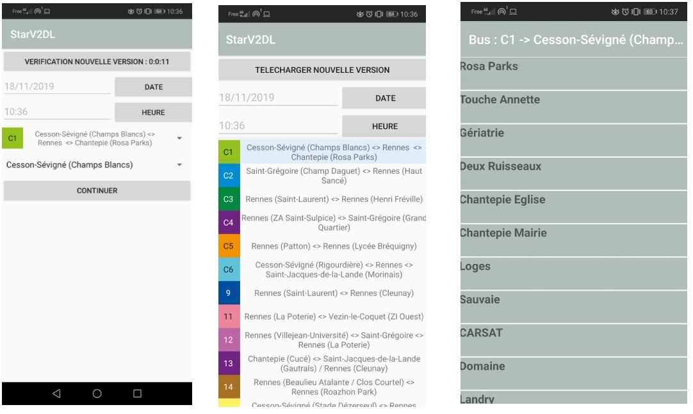

# STAR-APPLI-MOBILE
Un projet d'école pour la réalisation d'une application mobile. 
Star est la société de transports communs dans l'agglomération rennaise.
ce application permet de rechercher des itinéraires et horaires à votre arrêt, du réseau et parcs relais, état du trafic. 
le TP se limite à lister les bus et à rechercher les horaires de bus pour une date et à partir d'une heure.
les fichiers Csv sont disponibles sur le site de l'entreprise. l'application va rechercher les nouveaux horaires dispobilbe et faire la mise à jour.
Ci-dessous les capture d'écran.

